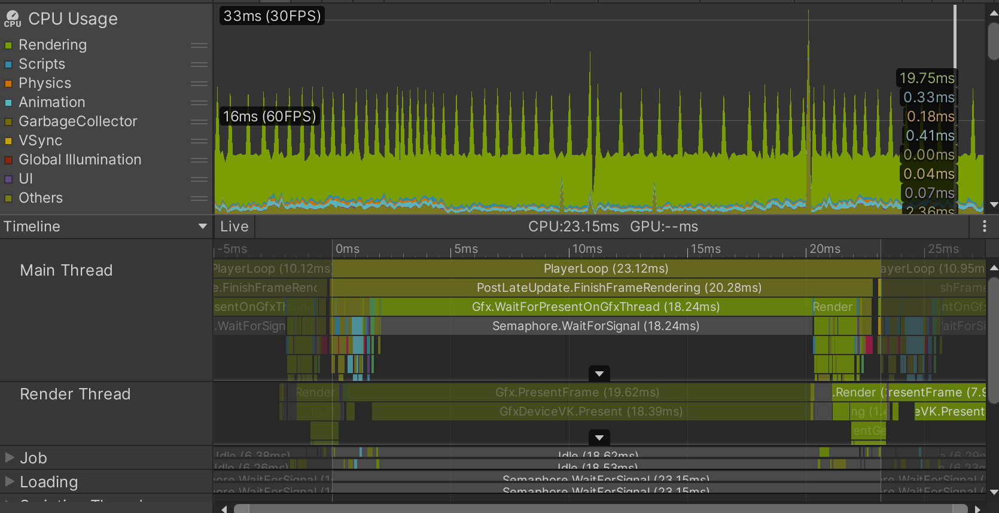
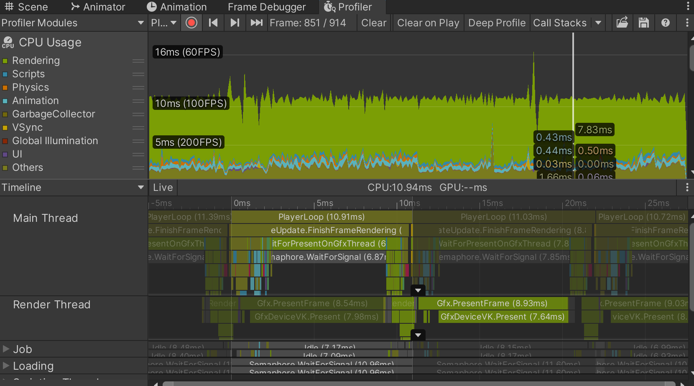

# Unity: Advanced Tutorials

## How do I fix performance issues?

This one's tricky - there's a lot of things that can lead to performance issues.
You should almost certainly use a profiler (such as the built-in Unity one)
to identify performance bottlenecks.
Below are screenshots of the profiler of a mobile game the writer was working on:

| With significant problems | With reduced problems |
|---|---|
|||

However, fixing performance issues is highly dependent on the platform, game, and even settings.
For instance, mobile platforms generally are underpowered compared to desktop platforms
(I don't think most phones have a dedicated graphics card sticking out of them, but hey, be the change you wish to see),
so performance matters more for mobile platforms.
I highly advise reading this resource by Unity, which goes into a LOT more optimizations in more detail:
https://unity.com/resources/mobile-xr-web-game-performance-optimization-unity-6

For now, I'll just list a couple that I found to be helpful.

### First, identify if the game's CPU- or GPU-limited.

Broadly speaking, the CPU is responsible for executing most of your logic (e.g. `Update`, `Awake`, `FixedUpdate`, etc.).
The GPU is responsible for actually rendering your game: turning your materials and triangles into an image.

The first step is to figure out where most of the performance issues are, so you can optimize accordingly.

If the profiler indicates most of the time is spent executing user code
(e.g. `Update` or computing physics), you should probably look into optimizing scripts or reducing physics objects.

If it's spent waiting for the render thread (e.g. in the above screenshot, `Gfx.WaitForPresentOnGfxThread`),
it's likely GPU bound, and you would need to focus on optimizing rendering.

### The game's CPU bound. What now?

You'll likely be optimizing scripts and physics, as those are typically done via the CPU.

Aside from optimizations in your existing code (e.g. using more efficient data structures),
there's a few things you can do, most of these taken from the aforementioned resource:
1. Reduce logic done every frame
   1. If there's logic done every frame (e.g. in `Update`, `LateUpdate`, `FixedUpdate`)
but it doesn't have to be, move it to `Awake` or `Start`
      1. For instance, results from `GetComponent` calls should ideally be cached in `Awake` or `Start`
   2. Even empty Update functions i.e. `void Update(){}` still require resources, so remove them if blank
2. Remove Debug statements
3. Use Object Pooling if you see yourself instantiating and deleting a lot of objects
   1. Instantiation and subsequent deletion requires cleanup of the memory via Garbage Collection,
which results in CPU load.
Particle systems should do this automatically, but for non-particle system objects, you can consider looking into
using something like [`ObjectPool`](https://docs.unity3d.com/6000.0/Documentation/ScriptReference/Pool.ObjectPool_1.html)
4. Avoid large canvases with lots of possibly overlapping elements
   1. It's recommended to split up canvases into multiple canvases
5. Simplify colliders to reduce the number of possible physics objects.
for instance, if you can approximate a complex object with a square or cube, use that

### The game's GPU bound. What now?

There's many possible optimizations if the game's on the GPU, ranging from optimizing shaders to baking lighting.
I'll just list a few here, but there's many more listed in the above resource:
1. Reduce the number of vertices or triangles
   1. If you can simplify some shapes (e.g. a rectangle tiled 1000 times versus a stretched rectangle), do so
2. Reduce the number of draw calls
   1. You can see Draw calls using the [Frame debugger](https://docs.unity3d.com/6000.2/Documentation/Manual/FrameDebugger-landing.html)
   2. For 2D games, use [Sprite Atlases](https://docs.unity3d.com/6000.3/Documentation/Manual/sprite/atlas/sprite-atlas-reference.html) to batch calls
   3. Reduce the number of unique materials — share them, ideally.
3. Reduce texture/sprite sizes
   1. This was actually the improvement in the Profiler screenshot above!
   2. Also consider enabling [mipmaps](https://docs.unity3d.com/6000.2/Documentation/Manual/texture-mipmaps-introduction.html)
4. Reduce or disable shadows if not needed

## WIP
