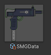

# Unity: Not Just Basics

## Defining custom editors

Sometimes you may want to make editing values in a script easier
(e.g. a button to jump to a specific location).
Custom editors let you do that, and a lot more!
Start by defining a custom editor in the Editor folder (under Assets):

> [!IMPORTANT]
> You need to place it in the Editor folder or surround it with `#if UNITY_EDITOR`,
> otherwise your game may not build when you try to build a standalone build!
>
> This is because UnityEditor related functions aren't defined when building a standalone build.
> Anything Editor related should either be surrounded with `#if UNITY_EDITOR` or in the Editor folder,
> or else you may encounter failures when building a standalone executable!

Add the `[CustomEditor(typeof(YourScriptClass))]` attribute to the editor, something like:

```csharp
[CustomEditor(typeof(YourScriptClass))]
public class YourNewEditor : UnityEditor.Editor
{
    // to run on editor enable
    private void OnEnable() { }

    // to modify the inspector
    public override void OnInspectorGUI() 
    {
        base.OnInspectorGUI();
    }

    // to render things in the scene view
    private void OnSceneGUI() { }

    // to modify the square preview in the editor
    public override Texture2D RenderStaticPreview(string assetPath, Object[] subAssets, int width, int height)
    {
        base.RenderStaticPreview(assetPath, subAssets, width, height);
    }
}
```

You can find more information on the Documentation:
https://docs.unity3d.com/6000.2/Documentation/Manual/editor-CustomEditors.html

### Why can't my new Editor edit multiple objects?

You need to attach the `[CanEditMultipleObjects]` attribute.
If you want it to edit multiple objects but don't feel like writing custom Inspector code to handle multiple objects,
a simple hack is to do the following:

```csharp
public override void OnInspectorGUI()
{
    base.OnInspectorGUI();
    if (targets.Length > 1) return;
    // custom logic here
}
```

Note that if you want to support multiple objects,
use the `serializedObject` field, or use the `targets` field to access the script instances being modified
rather than just `target`.

### How do I add new labels or buttons?

Use `GUILayout.Button("Your text")` for buttons, and `GUILayout.Label("Your text")` for labels.

For instance:

```csharp
public override void OnInspectorGUI()
{
    base.OnInspectorGUI();
    if (GUILayout.Button("Your button"))
    {
        Debug.Log("Button pressed!");
    }
    GUILayout.Label("Additional label text");
}
```

### How do I hide a field in the Inspector?

Sometimes you can have a LOT of fields, some of which are only used in some cases
(e.g. if an enum is set to a specific value).

You can use `DrawPropertiesExcluding(serializedObject, nameof(FieldToBeExcluded));` to draw the inspector without those
fields:

Here's a simple example (note: there's a few things missing, such as Undo):

```csharp
public override void OnInspectorGUI()
{
    serializedObject.Update();
    EditorGUI.BeginChangeCheck();
    bool shouldExcludeField = true;

    // generally most script inspectors have an "m_Script" field,
    // but to the user it might be kind of obvious
    // so we can remove it!
    List<string> excluded = new() { "m_Script" };
    if (shouldExcludeField)
        excluded.Add(nameof(YourScript.specificField));
    DrawPropertiesExcluding(serializedObject, excluded.ToArray());
    // Drawing properties doesn't actually update the fields the user modifies
    // this section does so
    if (EditorGUI.EndChangeCheck())
    {
        EditorUtility.SetDirty(target);
        serializedObject.ApplyModifiedProperties();
    }
}
```

### How do I allow editing script values in the Scene View itself?

For instance, updating a `Vector3` field for a position can be tedious in the Inspector.
You can instead modify it with a [Handle](https://docs.unity3d.com/ScriptReference/Handles.html)!

For example:

```csharp
private void OnSceneGUI()
{
    YourScript yourScriptInstance = target as YourScript;
    EditorGUI.BeginChangeCheck();
    Vector3 newPos = Handles.PositionHandle(yourScriptInstance.someValue, Quaternion.identity);
    if (EditorGUI.EndChangeCheck())
    {
        Undo.RecordObject(yourScriptInstance, "Change position");
        // these properties could be in OnEnable, but this is shorter
        serializedObject.FindProperty(nameof(YourScript.someValue)).vector3Value = newPos;
        serializedObject.ApplyModifiedProperties();
    }
```

There's a few other handles, such as a radius or rotation handle. Try them out!

#### What if I just want to preview values but don't necessarily need to modify them?

In this case, you don't actually need a custom editor, you can use Gizmos!

In your Script, implement `OnDrawGizmos` or `OnDrawGizmosSelected`, e.g.:

```csharp
private void OnDrawGizmosSelected()
{
    Gizmos.color = Color.red;
    Gizmos.DrawWireSphere(yourField, 1);
}
```

See more information here: https://docs.unity3d.com/6000.2/Documentation/ScriptReference/Gizmos.html

### How do I modify the preview in the Editor?


Scriptable object typically don't have a preview, which may be hard to organize.

You can customize the scriptable object preview by overriding `RenderStaticPreview`:

```csharp
public override Texture2D RenderStaticPreview(string assetPath, Object[] subAssets, int width, int height)
{
    YourScript instance = (YourScript)target;
    if (instance == null || instance.sprite == null)
        return null;
    Texture2D tex = new(width, height);
    EditorUtility.CopySerialized(instance.sprite.texture, tex);
    return tex;
}
```

If done correctly, it may look like this:



See more information here: https://docs.unity3d.com/ScriptReference/Editor.RenderStaticPreview.html

## How do I add new menu items?

Menu items don't actually need to be in an Editor class — they can just be in any other class.
However, it still applies that it shouldn't be added to standalone build code,
so it would be helpful to leave it in an Editor class.

To create a menu item, use the `[MenuItem("Path/To/Item")]` attribute.
An example:
```csharp
public static class MenuItems
{
    [MenuItem("Assets/Your Menu Item")]
    private static void YourMenuItem() 
    {
        Debug.Log("Your menu item clicked!");
    }
}
```

You can also add hot-keys, e.g. by doing `[MenuItem("Assets/Menu #%G")]`,
the code will run when you type Shift-Ctrl/Cmd-G.

See more information here: https://docs.unity3d.com/ScriptReference/MenuItem.html
