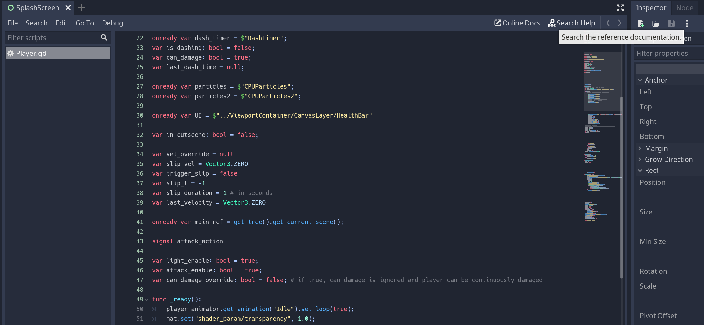
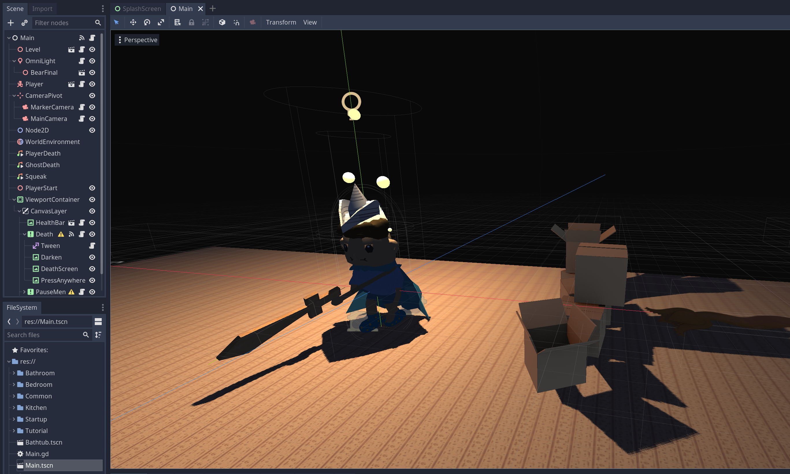

# Godot

<!-- Someone else add screenshots - I don't actively have projects in Godot at the moment -->

A free and open source game engine for 2D and 3D games ([download link](https://godotengine.org/download/)).
Scripting in Godot is done in the Python-like proprietary language GDScript. C# (requires the .NET/Mono version) is receiving development to become a viable alternative. There are also bindings for other languages including C++ and Rust.

**NOTE: Godot 4.0 is the current major release, and is largely not interchangeable with Godot 3.0. Resources will be for Godot 4.0 as it is the currently developed version.**

## Introduction

When working with GDScript, the [docs](https://docs.godotengine.org/en/stable/) are always the best way to learn about the language reference, and are accessible within the engine in any script editor.

In both 2D and 3D, Godot is organized as a tree of **nodes** that can have **scripts**, saved as .gd files, attached to them. Scenes are predefined node trees that can be loaded, saved as .tscn files. Nodes can be added to the tree inheriting a built in type, described in the docs, that is then extended with the attached script.

### Beginner Project Tutorials
The following are tutorials that try to accquaint you with the general Godot Engine through a slightly longer project format.
- [Your First 2D Game](https://docs.godotengine.org/en/stable/getting_started/first_2d_game/index.html) from the Godot Foundation, an introduction to Godot for 2D Projects.
- [Your First 3D Game](https://docs.godotengine.org/en/stable/getting_started/first_3d_game/index.html) from the Godot Foundation, an introduction to Godot for 3D Projects.
- [Heartbeast Space Shooter Game Tutorial](https://www.youtube.com/watch?v=zUeLesdL7lE&list=PL9FzW-m48fn09w6j8NowI_pSBVcsb3V78) Heartbeast has produced many well known tutorial series for development with Godot, this is one for a 2D game in Godot 4.0.
- [Brackeys How to Make a Game With Godot](https://www.youtube.com/watch?v=LOhfqjmasi0&t=11s) Brackeys, the well known Unity content creator has begun creating beginner content for Godot 4.0.
- [Kids Can Code Godot 101](https://kidscancode.org/godot_recipes/4.x/g101/index.html) is more like a textbook, Kids Can Code is a resource you will often find for working with Godot as a supplement to the manual, this is their in depth write-up to acquaint readers with the engine.

