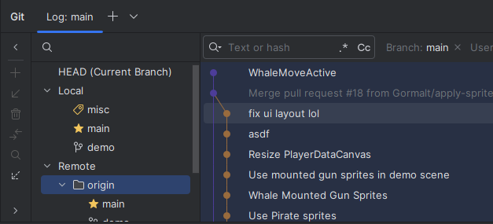

# Source Control

Source control is the process of tracking changes to your game's assets, allowing easier collaboration and version management.
There are many source control tools out there, but one of the most common ones is [Git](https://git-scm.com/downloads), used by everyone from students (CPSC 210 anyone?) to multi-billion dollar corporations.

(This document mostly focuses on Git and GitHub, as it's the one I'm most familiar with, and is fairly common.)

## Setting up Git
If you haven't already, first download git from [their website](https://git-scm.com/downloads).

There's a few other tools that make Git easier to use, such as providing a Graphical User Interface (GUI):
- [GitHub Desktop](https://desktop.github.com/download/) is a free tool that integrates well with GitHub.
- Most IDEs also have extensions or have Git Built-in:
  - [Rider](https://www.jetbrains.com/rider/) is free with a student license, and comes with a GUI to see your history and to make changes. (This is what I use on a regular basis at work and for personal projects)
  - [VS Code](https://code.visualstudio.com/) is completely free, and comes built-in with source control management.

(Or, if GUIs aren't your thing, you could use the Command Line Interface (CLI), but that might be slower if you don't type very quickly and don't have the commands memorized - like me).

Depending on if you're creating your project or if you're working on an existing one, there may already be a Git repository.

### There's an existing repository
Some teams use [GitHub](https://github.com) to host their code (either publicly or privately), and if the project already has a repository on GitHub, you may not have to create a new one.

Clone the repository to your machine by using Git:
- Most software (e.g. GitHub Desktop/Rider) supports a Get from VCS (short for Version Control System), which would download it locally
- Alternatively, run `git clone <url>`

> [!IMPORTANT]
> Do NOT use the "Download ZIP" button on GitHub. It would download the code, but Git requires a `.git` directory that gets initialized when `git clone` or most VCS tools clones the repo, and downloading the ZIP does not include that directory.    

### There is no repository
If there is no repository, you can [create one on GitHub](https://github.com/new).
Once created, you can upload your assets to the repository.

> [!Note]
> Some tools (e.g. Rider) allows you to create a repository from your code if one isn't present - such a menu option like 'Share Project on GitHub'

## The typical workflow (branches)
After the repository is cloned, we can make changes to our local version, and then update the remote repository.
The typical steps are as follows:

1. Create a new branch (unless you want to directly modify the main branch on GitHub), e.g. `cool-changes`
2. Commit your changes locally to your new branch.
3. Push your new branch to the repository
   1. If you don't have push permissions, ask the administrator of the repository to add you as a collaborator.
   2. If they insist on not doing that, read [the forking workflow](#the-forking-workflow)
4. Create a pull request (or PR) on the repository against main/master (on the repository website: Pull Requests > New Pull Request)
   1. Some teams may require someone else to review your before merging your changes before merging - you can request it here.
5. Merge your changes to main/master
   1. There's two options: Merge (which keeps your commit history) and Squash (which converts all your commits into 1) - either would work, but you may want to ask in case your team insists on a specific convention
6. Done!

## The forking workflow
In some projects, there could be too many collaborators working on a project (and exceeds GitHub's limit), or maintainers do not trust people to arbitrarily make changes to the main branch (e.g. some malicious actor adding a cryptominer into the project). 
(A lot of open source projects use this workflow.)

In this case, you would have to do something different:
1. Create a fork of the repository (there should be a button on the repository page on GitHub to do so)
2. Commit and push your changes to your own repository.
   1. This can be to your main or master branch - it's not modifying their repository, which is the one they're trying to protect.
3. Create a pull request on the repository against main/master using your branch
4. Wait for the pull request to be merged - there may be a review process