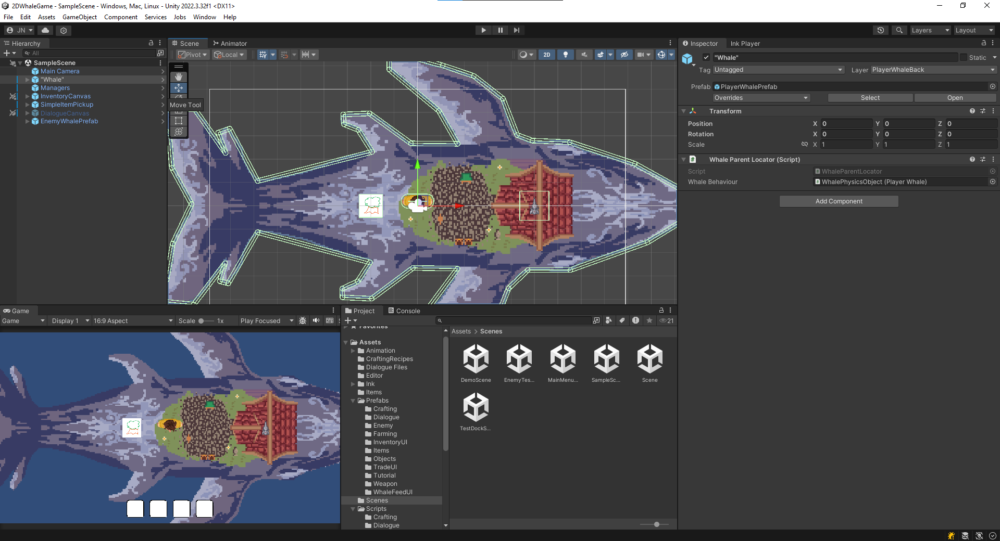

# Unity

Supports 2D/3D games for most common platforms; note that other build platforms (e.g. web, native iOS) may require additional components.
Programming is done in C#, but there is an optional visual scripting package.

Free with Unity Student or Personal (see: https://unity.com/products) if your game makes less than \$200k USD (as of writing - October 2024).

## Tips

- GitHub provides a gitignore file for Unity projects: https://github.com/github/gitignore/blob/main/Unity.gitignore (one may also want to add `.idea` to the file if using Rider)
- If multiple people are working on a scene at the same time, it would be potentially helpful to use prefabs so if there's a Git merge conflict, it is easier to resolve (either by reducing the number of objects to resolve, or simply allowing a person to re-add changes if it gets accidentally deleted)

## Glossary
Sometimes, it can be hard to keep track of what each thing means, so just to make things easier in the beginning, here are some common words that will be popping up.

**GameObject**: Basically, everything you place in the game will be a GameObject with some added behaviour through _components_. Gameobjects are unique; every time you place one, they will be different from others unless made with a prefab. GameObjects can be seen on your scene or hierarchy view. E.g. an enemy, box, bridge, bullet etc;

**Component**: In unity, components give behaviours to most things; they can be added to objects to provide particular properties and store information. They can be found in the details view when a GameObject is selected. E.g. a player's inventory, an enemy's AI, or what makes a wall stop you from going through it.

**Prefab**: a "blueprint" of an object and its components; this allows us to place multiple of the same object and change all of them in the same place instead of one by one. Done by moving an object in a scene back into the assets screen in unity. Located in the assets folder. For example, a generic version of a bullet is used every time a shot is fired to create the bullet object in the game as a copy of it.

**Scene**: A file that holds all the information we want on a screen/level; it contains the camera, UI, and all objects and their positions, etc. All configurations made inside a scene are unique (unless you are working with prefabs. E.g. a Mario level, the entire snake game, etc.

**Inspector**: The panel in Unity that display's a GameObject or Component's data. Can be customized (i.e. a custom inspector).

**Editor**: Typically refers to the Unity Editor - what you use to modify the game. May also refer to Custom Editors for objects (e.g. custom inspectors).

**ScriptableObject**: A data container to contain shared data in the project, typically saved to an asset in the project.