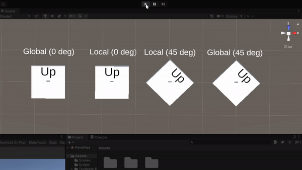
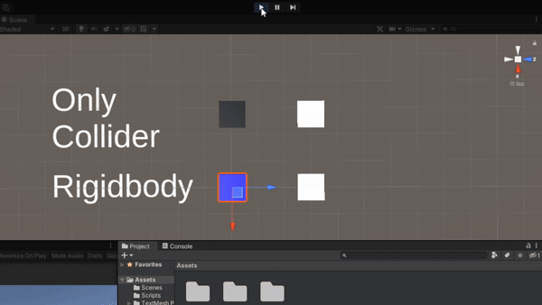
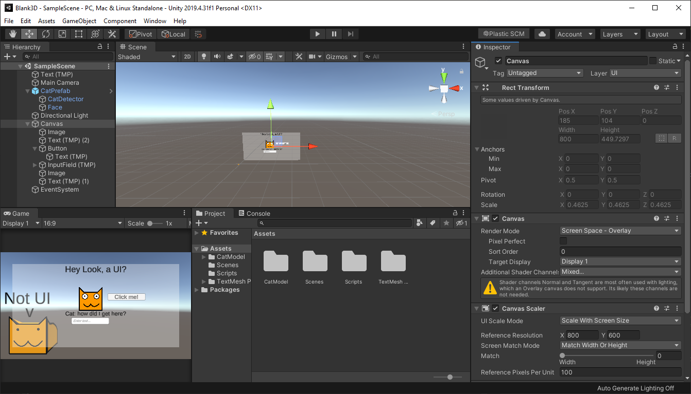
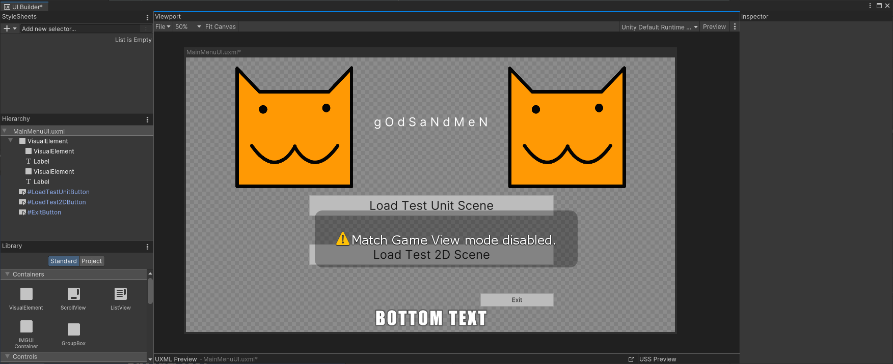
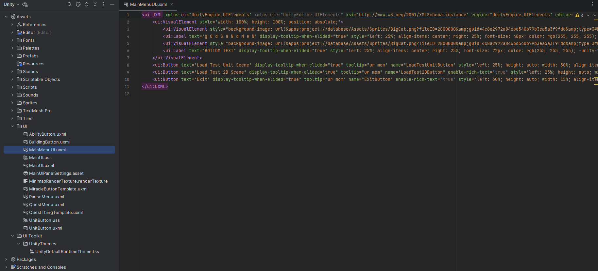

# Unity: The Basics

## How do I get an object to move via script?

There's two ways to do it.

### Directly modify transform position

If you're not too worried about collisions or doing this movement as a one-off, you could simply directly modify the transform's position:
```csharp
public class YourBehaviour : MonoBehaviour
{
    //...

    private void Awake() {
        transform.position = new Vector3(5, 6, 7);
    }
    //...
}
```

Alternatively, you could modify the local position of the object via `transform.localPosition` if you want to modify it relative to its parent.

However, keep in mind doing modifications in local space would also use any local rotations and scaling (see below as an example).



### Using Rigidbodies

Note there's a pitfall with constantly moving objects: they would need Rigidbodies in order for collisions to be consistently detected.



If the object will be repeatedly moving, it would be better to give the object a Rigidbody before performing motion to allow better collision detection.

```csharp
public class YourBehaviour : MonoBehaviour
{
    //...
    private Rigidbody _rigidbody;
    private void Awake() {
        // since Update() runs every frame, it's better to not call GetComponent every frame since it's not performant
        // thus we save it here
        _rigidbody = GetComponent<Rigidbody>();
        // if 2D, use GetComponent<Rigidbody2D>();
    }
    //...

    private void Update() {
        // instantly moves from A -> B, in world space
        _rigidbody.position = new Vector3(5, 6, 7);
        // moves (interpolating in between) from A -> B in 1 physics update (approximately 0.02 seconds)
        _rigidbody.MovePosition(new Vector3(5, 6, 7);
    }
    //...
}
```

Alternatively, you can modify the rigidbody's velocity instead, especially if you want it to obey physics:

```csharp
public class YourBehaviour : MonoBehaviour
{
    //...
    private Rigidbody _rigidbody;
    private void Awake() {
        _rigidbody = GetComponent<Rigidbody>();
    }
    //...

    private void Update() {
        // instantly sets velocity
        _rigidbody.velocity = new Vector3(5, 6, 7);
        // applies a force; there's multiple types:
        //  - Force (the default): modifies velocity by inputVector * Time.fixedDeltaTime / _rigidbody.mass
        //  - Acceleration: modifies velocity by inputVector * Time.fixedDeltaTime
        //  - Impulse: modifies velocity by inputVector / _rigidbody.mass
        //  - VelocityChange: modifies velocity by inputVector
        _rigidbody.AddForce(new Vector3(5, 6, 7));
        _rigidbody.AddForce(new Vector3(5, 6, 7), ForceMode.VelocityChange);
    }
    //...
}
```

There's a few other methods as well, see Unity's documentation for more: ([Script reference](https://docs.unity3d.com/ScriptReference/Rigidbody.html), [Manual](https://docs.unity3d.com/Manual/RigidbodiesOverview.html)).

## How do I create a UI?

Unity supports multiple ways to make UIs:
- Unity UI (uGUI) - the older system, where the UIs are GameObjects
- UI Toolkit - something more similar to web development, where the UIs are created with XML/CSS (which they call UXML/USS)
- IMGUI - I don't know what this is - this apparently is almost entirely defined by code??

See more information here: https://docs.unity3d.com/Manual/UIToolkits.html

### Unity UI (uGUI)

Below is a very simple UI I made in 5-10 minutes, most of which was spent locating the 3D cat model I had lying around.



Unity UI (uGUI) uses the normal GameObject and MonoBehaviour system.
The process is as follows:

1. Add a Canvas to the scene
    1. There's some performance reasons as to splitting multiple different displayed UIs into multiple Canvases (even if they're children of each other), but it also makes it easier to maintain
2. Add various UI elements to it
    1. The one above uses [Text Mesh Pro](https://docs.unity3d.com/Packages/com.unity.ugui@2.0/manual/TextMeshPro/index.html) text elements, images, buttons and text areas
    2. Position those elements by adjusting the positions, anchors and pivots
        1. There's a square icon that when clicked, lists a menu of common alignments for UI elements (e.g. stretching to fill space, or alignment to the top left corner)

> [!TIP]
> The default Canvas Scalar behaviour on the canvas defaults to 'Constant Pixel Size', which does not adjust for screen sizes.
> 
> I typically set mine to 'Scale with Screen Size' and set a desired reference resolution (e.g. 1920x1080) to scale correctly.

> [!Warning]
> Modifying the scale of UI elements may result in weird behaviours, such as the 'hitboxes' of buttons being incorrect, as the UI position system is somewhat different from the scale system.
> Try to avoid modifying the scale when possible, although the root canvas generally has the scale modified to adjust for different screen sizes.


### UI Toolkit



This UI system is more like HTML (as the UIs are built with their own XML toolkit, or uXML) rather than GameObjects.
The general process is as follows:

1. Add a UI Document to the scene
2. Create a Visual Tree Asset written in UXML or using the built-in UI builder
3. Add the visual tree asset to the UI Document

This may be easier for people more familiar with web development, as the saved assets use XML (or UXML), which resemble that of HTML assets:



### IMGUI

WIP <!-- i'm not too familiar with this -->