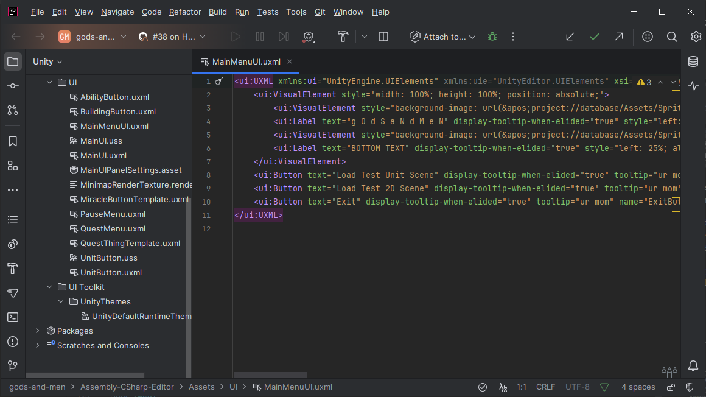

# Unity: The Basics

## How do I get an object to move via script?

There's two ways to do it.

### Directly modify transform position

If you're not too worried about collisions or doing this movement as a one-off, you could simply directly modify the
transform's position:

```csharp
public class YourBehaviour : MonoBehaviour
{
    //...

    private void Awake() {
        transform.position = new Vector3(5, 6, 7);
    }
    //...
}
```

Alternatively, you could modify the local position of the object via `transform.localPosition` if you want to modify it
relative to its parent.

However, keep in mind doing modifications in local space would also use any local rotations and scaling (see below as an
example).


### Using Rigidbodies

Note there's a pitfall with constantly moving objects: they would need Rigidbodies in order for collisions to be
consistently detected.


If the object will be repeatedly moving, it would be better to give the object a Rigidbody before performing motion to
allow better collision detection.

```csharp
public class YourBehaviour : MonoBehaviour
{
    //...
    private Rigidbody _rigidbody;
    private void Awake() {
        // since Update() runs every frame, it's better to not call GetComponent every frame since it's not performant
        // thus we save it here
        _rigidbody = GetComponent<Rigidbody>();
        // if 2D, use GetComponent<Rigidbody2D>();
    }
    //...

    private void Update() {
        // instantly moves from A -> B, in world space
        _rigidbody.position = new Vector3(5, 6, 7);
        // moves (interpolating in between) from A -> B in 1 physics update (approximately 0.02 seconds)
        _rigidbody.MovePosition(new Vector3(5, 6, 7);
    }
    //...
}
```

Alternatively, you can modify the rigidbody's velocity instead, especially if you want it to obey physics:

```csharp
public class YourBehaviour : MonoBehaviour
{
    //...
    private Rigidbody _rigidbody;
    private void Awake() {
        _rigidbody = GetComponent<Rigidbody>();
    }
    //...

    private void Update() {
        // instantly sets velocity
        _rigidbody.velocity = new Vector3(5, 6, 7);
        // applies a force; there's multiple types:
        //  - Force (the default): modifies velocity by inputVector * Time.fixedDeltaTime / _rigidbody.mass
        //  - Acceleration: modifies velocity by inputVector * Time.fixedDeltaTime
        //  - Impulse: modifies velocity by inputVector / _rigidbody.mass
        //  - VelocityChange: modifies velocity by inputVector
        _rigidbody.AddForce(new Vector3(5, 6, 7));
        _rigidbody.AddForce(new Vector3(5, 6, 7), ForceMode.VelocityChange);
    }
    //...
}
```

There's a few other methods as well, see Unity's documentation for
more: ([Script reference](https://docs.unity3d.com/ScriptReference/Rigidbody.html), [Manual](https://docs.unity3d.com/Manual/RigidbodiesOverview.html)).

## How do I create a UI?

Unity supports multiple ways to make UIs:

- Unity UI (uGUI) - the older system, where the UIs are GameObjects
- UI Toolkit - something more similar to web development, where the UIs are created with XML/CSS (which they call
  UXML/USS)
- IMGUI - I don't know what this is - this apparently is almost entirely defined by code??

See more information here: https://docs.unity3d.com/Manual/UIToolkits.html

### Unity UI (uGUI)

Below is a very simple UI I made in 5-10 minutes, most of which was spent locating the 3D cat model I had lying around.


Unity UI (uGUI) uses the normal GameObject and MonoBehaviour system.
The process is as follows:

1. Add a Canvas to the scene
    1. There's some performance reasons as to splitting multiple different displayed UIs into multiple Canvases (even if
       they're children of each other), but it also makes it easier to maintain
2. Add various UI elements to it
    1. The one above
       uses [Text Mesh Pro](https://docs.unity3d.com/Packages/com.unity.ugui@2.0/manual/TextMeshPro/index.html) text
       elements, images, buttons and text areas
    2. Position those elements by adjusting the positions, anchors and pivots
        1. There's a square icon that when clicked, lists a menu of common alignments for UI elements (e.g. stretching
           to fill space, or alignment to the top left corner)

> [!TIP]
> The default Canvas Scalar behaviour on the canvas defaults to 'Constant Pixel Size', which does not adjust for screen
> sizes.
>
> I typically set mine to 'Scale with Screen Size' and set a desired reference resolution (e.g. 1920x1080) to scale
> correctly.

> [!Warning]
> Modifying the scale of UI elements may result in weird behaviours, such as the 'hitboxes' of buttons being incorrect,
> as the UI position system is somewhat different from the scale system.
> Try to avoid modifying the scale when possible, although the root canvas generally has the scale modified to adjust
> for different screen sizes.

### UI Toolkit


This UI system is more like HTML (as the UIs are built with their own XML toolkit, or uXML) rather than GameObjects.
The general process is as follows:

1. Add a UI Document to the scene
2. Create a Visual Tree Asset written in UXML or using the built-in UI builder
3. Add the visual tree asset to the UI Document

This may be easier for people more familiar with web development, as the saved assets use XML (or UXML), which resemble
that of HTML assets:



### IMGUI

WIP <!-- i'm not too familiar with this -->

## How do I locate X via script?

There's many, many ways, depending on how you want to locate the object. I'll list the common entries:

1. Finding a behaviour in this object, children or parent: use `GetComponent[s]<Type>()`,
   `GetComponent[s]InChildren<Type>()` and `GetComponent[s]InParent<Type>()` respectively.
2. Locating objects you collide with: See documentation
   for [OnCollisionEnter](https://docs.unity3d.com/ScriptReference/Collider.OnCollisionEnter.html) (or the 2D
   equivalent [OnCollisionEnter2D](https://docs.unity3d.com/ScriptReference/Collider2D.OnCollisionEnter2D.html)).

```csharp
public class YourBehaviour : MonoBehaviour
{
    //...
    // if using 2D physics, use OnCollisionEnter2D, or else this event will not be called!
    private void OnCollisionEnter(Collision collision) {
        GameObject collidedObject = collision.gameObject;
        // ...
    }
    //...
}
```

3. Locating objects by name: use `GameObject.Find("name");`
    1. This isn't very performant, so try to avoid doing this every frame. One way to do this is to save the result in
       Awake or Start.
4. Locating objects by tag: use `GameObject.FindObject[s]WithTag("tag")`
    1. Also not very performant - see above.
5. Locating an instance of a behaviour: use `FindObject[s]OfType<Type>()`
    1. Also not very performant.
6. Locating a specific object you want to define via the editor: add the following to your script, and you can now drag
   and drop objects into the field in the inspector.

```csharp
public class YourBehaviour : MonoBehaviour
{
    public GameObject publicObjectToLocate;
    
    // if you don't want other classes modifying this due to encapsulation reasons:
    [SerializeField]
    private GameObject objectToLocate;
}
```

If you have a single instance of a behaviour in a scene and you want to access it without manually assigning it to every
object that uses it, try something like this:

```csharp
// prevents you from adding this twice to an object
[DisallowMultipleComponent]
public class YourBehaviourToBeLocated : MonoBehaviour
{
    private static YourBehaviourToBeLocated _instance;
    public static YourBehaviourToBeLocated Instance
    {
        // suppressing since this doesn't run every frame (or at least, *shouldn't*)
        // ReSharper disable once Unity.PerformanceCriticalCodeInvocation
        get
        {
            if (_instance == null) _instance = FindObjectOfType<CrossRunInfo>();
            return _instance;
        }
    }
    
    private void Awake() {
        _instance = this; // might want a check here to make sure you don't have multiple!
    }
    
    private void OnDestroy() {
        _instance = null;
    }
}
```

Then, any time you want to locate the object, you can simply do `YourBehaviourToBeLocated.Instance`.

> [!Warning]
> This isn't the best implementation of this pattern (in fact, it has almost zero guardrails to ensure things don't
> break).
> Unlike the actual [Singleton pattern](https://en.wikipedia.org/wiki/Singleton_pattern) this is based off of, this very
> simple implementation does NOT have any checks to make sure you don't instantiate multiple of this object.
> You could add a check to make sure one doesn't instantiate (or if one is detected, self-destruct), but this is alright
> if you have this object in the scene and know you don't instantiate anything.

## How do I run code every X seconds or with a delay?

You'd probably want to use [coroutines](https://docs.unity3d.com/6000.0/Documentation/Manual/coroutines.html).

> [!TIP]
> For object destruction, `Object.Destroy` can take in a time parameter to avoid defining a coroutine like below:
> `Object.Destroy(object, time)`.

```csharp
public class YourBehaviour : MonoBehaviour
{
    private IEnumerator _coroutine;
    
    private void Awake() {
        // you might want to save it in case you want to stop it later with StopCoroutine(_coroutine)
        _coroutine = YourCoroutine();
        StartCoroutine(_coroutine);
    }
    
    private IEnumerator YourCoroutine() {
        // if you instead want a delay and not run every X seconds, remove the while loop
        while (true) {
            yield return new WaitForSeconds(1);
            // code to execute here
            Debug.Log("Waited 1 second!");
        }
    }
}
```

> [!TIP]
> Doing `yield return null` would wait for the next frame, if you don't want to specify a duration.

> [!Warning]
> If you set `Time.timeScale` to zero (e.g. if you freeze time when opening a UI),
> yielding on `WaitForSeconds(1)` will never return until `Time.timeScale` is positive.
> Use `WaitForSecondsRealtime` if you need it to occur in real time and not scaled time.