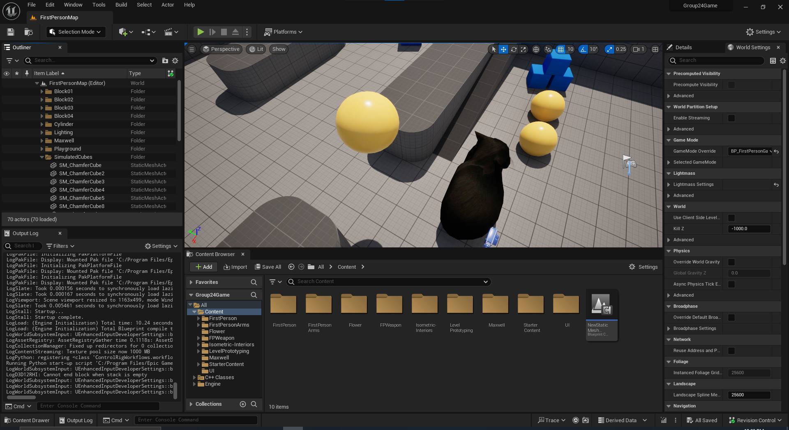

# Unreal Engine

Supports 2D and 3D games for most platforms.
Programming is done via Blueprint, a visual scripting language, but projects can use C++ if configured to do so.
Using C++ requires installing a compiler - typically Visual Studio for Windows, XCode for macOS.

## Tips
- Note that Unreal Engine saves all assets to binary files, which makes resolving Git conflicts significantly harder - it is highly recommended to use [Git LFS](https://git-lfs.com/) and use file locking, or use other version control systems
